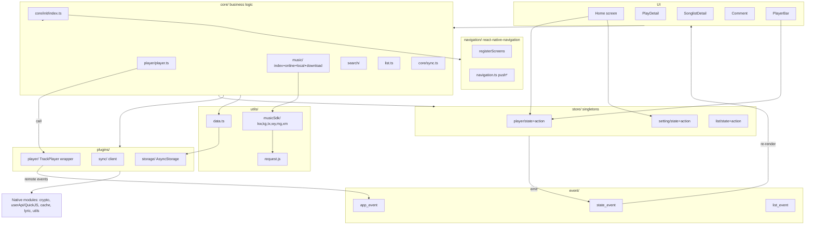
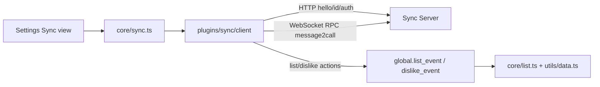

# ARCHITECTURE

## High-level shape
A **layered, module-singleton** architecture. There is no Redux. Business logic lives in `src/core` (pure TS, no React). State lives in per-domain singleton objects in `src/store`. React screens/components read state via domain hooks that subscribe to a global event emitter. UI events (button taps) call `core` functions, which mutate singleton state and emit events that re-render subscribed hooks.

Key consequence: **data does not flow "down" via props/context** — it flows through **module singletons + `global.state_event`**. Components read from the singleton (`state.*`) and re-render only when the matching `state_event` fires.

## Layering
```
Screens / Components (React, src/screens, src/components)
        |  read via hooks (store/*/hook.ts)      call into core
        v                                        v
   store/* (singleton state + actions)     core/* (business logic)
        |  mutate state, emit                  |  call
        v                                        v
   event/* (state/app/list/dislike hubs)  utils/* + plugins/* (musicSdk, player, sync, storage, request)
                                                     |
                                                     v
                                          Native modules (Android Java) + Network + FS/AsyncStorage
```

## State management pattern (critical to understand)
Each domain in `src/store/<domain>/` has:
- `state.ts` — a **module-level singleton** `const state = {...}` (imported by value everywhere; the same object reference is shared).
- `action.ts` — functions that **mutate** `state` fields and then call `global.state_event.<name>(...)` (and persist via `utils/data.ts` where needed).
- `hook.ts` — React hooks (`useState` + `useEffect` subscribing to `global.state_event`) that return the current value and re-render on the matching event.

Example (`setting`):
- Read: `settingState.setting` (import singleton) or `useSetting()` / `useSettingValue('common.langId')`.
- Write: `core/common.updateSetting({...})` → `settingActions.updateSetting` → mutate + `state_event.configUpdated(keys, setting)`.

The emitter (`src/event/Event.ts`) uses `setImmediate` so events are delivered async. `src/event/stateEvent.ts` (`StateEvent`) defines all typed state events. `global.lx`, `global.state_event`, `global.app_event`, `global.list_event`, `global.dislike_event` are created in `src/config/globalData.ts` at import time.

> When adding a piece of shared data: create/extend a domain's `state.ts`, add an action that mutates + emits, add a `stateEvent.ts` method if it must notify UI, and a hook to read it. Don't invent new global variables without a home.

## Dependency direction
- `screens` / `components` → `store` (hooks) + `core` (actions) + `navigation`.
- `core` → `store` (state+actions) + `utils` (data/musicSdk/request) + `plugins` (player/sync) + `config`.
- `store` → `config` + `utils` (persist) + `event`.
- `plugins/player` → `core/player` (for remote-control / event bridging) — **circular by design**; keep it at the function level, not module-eval side effects.
- `utils` should be leaf (no dependency on `core`/`store`). `musicSdk` is a leaf that uses `request.js`.
- **Do not** import React components into `core`; `core` must stay UI-free.

## Mermaid — overall


## Mermaid — playback control/state
```mermaid
graph LR
  A[User taps play / PlayDetail] --> B[core/player/player.playList|playListById]
  B --> C[setPlayMusicInfo -> playerState + state_event]
  B --> D[handlePlay -> getMusicPlayUrl]
  D --> E[core/music.getMusicUrl]
  E --> F[musicSdk source.getMusicUrl via apis(source)]
  F --> G[resolved audio URL]
  G --> H[plugins/player setResource -> TrackPlayer]
  H -- PlaybackState event --> I[plugins/player/service.ts]
  I --> J[global.app_event.playerPlay/pause]
  J --> K[playerState + state_event.playStateChanged]
  K --> L[UI PlayerBar / PlayDetail re-render]
```

## Cross-platform structure
- JS/TS code is shared; platform differences handled by `babel.config.js` extension resolution order (`*.android.ts` before `*.ts`, etc.) — you can add `foo.android.ts` / `foo.ios.ts` variants.
- Android-specific native modules live in `android/app/src/main/java/cn/toside/music/mobile/` (`crypto`, `userApi`, `cache`, `lyric`, `utils`). iOS equivalents are absent.
- `src/utils/nativeModules/*` wraps `NativeModules`/`NativeEventEmitter` for these.

## Threads / workers
- `react-native-track-player` runs the audio engine natively; events cross back via the playback-service bridge (`plugins/player/service.ts`).
- User API scripts run on a dedicated native `HandlerThread` inside a **QuickJS** engine (`userApi/QuickJS.java`); JS↔script communication is via `sendAction`/`onScriptAction`.
- Background timers use `react-native-background-timer` (player retry/next delays, user-api request timeout).
- No JS Worker threads; no web workers.

## Mermaid — sync


## Cross-references
- What each directory/file does: `MODULES.md`
- Step-by-step flows: `DATA_FLOW.md`
- Network/source details: `API.md`
- Fragile areas (player, sync, native, storage): `RISKS.md`
