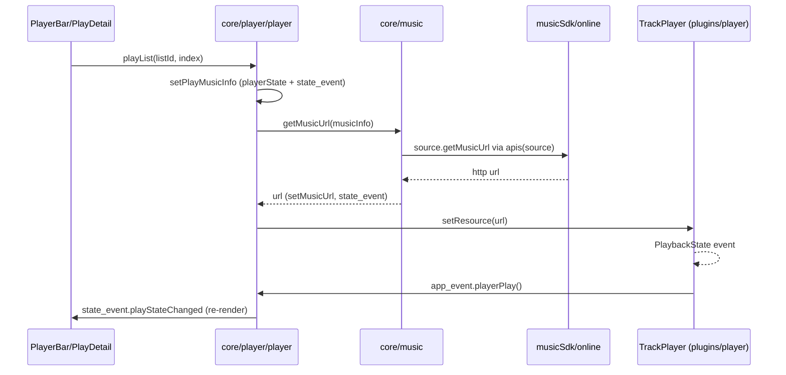

# DATA_FLOW

End-to-end workflows. State lives in `src/store/*` singletons; UI re-renders via `global.state_event`. See ARCHITECTURE.md for the mechanism.

## 1. App startup
1. `index.js` → `shim.js` + `src/app.ts`.
2. `app.ts`: build `global.lx` (`config/globalData.ts`), load font size + `windowSizeTools`, wait for native launch event.
3. `core/init/index.ts` (ordered):
   `initSetting` (load+migrate `LX.AppSetting`, emit `configUpdated`) → `initTheme` → `initI18n` → `initUserApi` (build `global.lx.apis`) → `setApiSource` → `registerPlaybackService` → `initPlayer` → `dataInit` (load lists/dislike/prev state) → `initCommonState` → `initSync`.
4. `navigation.init()` (already registered screens) → `pushHomeScreen()`.
- Failure path: any init throw → `tipDialog` → `exitApp()`.

## 2. Music search
1. UI: `screens/Home/Views/Search/*` → `core/search/music.ts` (`searchMusic`) or `core/search/songlist.ts`.
2. Fans out to sources via `utils/musicSdk/index.js` (`searchMusic` / per-source `musicSearch`), or the active API source.
3. Results stored in `store/search/music` (music) / `store/search/songlist` (songlists); UI subscribes via `store/search/*` hooks.
4. Search text/history in `core/search/search.ts`; history persisted via `utils/data.ts`.
- Toggle-source ("try other sources") is handled in `core/music/utils.ts` during URL resolution, not search.

## 3. Song playback (the critical path)
```
User taps play (PlayerBar / PlayDetail / search row)
  → core/player/player.playList(listId, index)  |  playListById(id, musicId)
  → setPlayMusicInfo(...)  →  playerState + state_event.playMusicInfoChanged / playInfoChanged
  → handlePlay(musicInfo)
      → getMusicPlayUrl(...)            # core/player/player.ts
      → core/music.getMusicUrl(...)     # core/music/index.ts (online|local|download)
      → [online] musicSdk<source>.getMusicUrl via apis(source)  →  resolved http url
             (fallback: core/music/utils.ts tries other qualities/sources)
      → setMusicUrl(...)                # write playerState.music, state_event
  → plugins/player/index setResource(url, extra)  →  TrackPlayer load/play
      → TrackPlayer PlaybackState event
      → plugins/player/service.ts
      → global.app_event.playerPlay()/playerPause()/playerStop()
      → core/player/player.ts listeners → playerState.setPlayState + state_event.playStateChanged
  → UI (PlayerBar / PlayDetail) re-render
```
- Progress: TrackPlayer position → `core/player/progress.ts` → `state_event.playProgressChanged` (driven by `useProgress`/TrackPlayer polling in `plugins/player/hook.ts`).
- Auto-next: on track end/error → `playNext()` → `getNextPlayMusicInfo()` honors `player.togglePlayMethod` (`listLoop | random | list | singleLoop | none`).
- Retry: `getMusicPlayUrl` retries with delay; "too many requests" triggers longer backoff (`requestMsg.tooManyRequests`).

## 4. My-lists CRUD + persistence
1. UI → `core/list.ts` (e.g. `addListMusics(listId, musics, index)`).
2. `core/list.ts` → `global.list_event.<action>(...)` (`src/event/listEvent.ts`).
3. `listEvent` updates in-memory cache (`utils/listManage.ts`) **and** persists via `utils/data.ts` (AsyncStorage `@list__<id>`) → emits `state_event.mylistUpdated(listId)` / `listMusicsChanged`.
4. Subscribed UI (Mylist view, search "add" buttons) re-renders.
- Sync (if enabled) also hooks into `global.list_event` to mirror changes to the server (see §6).

## 5. Custom source (user API) resolution
1. On init, `core/init/userApi/` runs the enabled script in the Android QuickJS engine (`utils/nativeModules/userApi.ts` → `userApi/QuickJS.java`).
2. Script requests app capabilities by calling the app's `request()`; the app answers via the `response()` bridge (20s timeout).
3. `global.lx.apis[user_api_<id>] = { getMusicUrl, getLyric, getPic }`.
4. When `common.apiSource` is `user_api_*`, `musicSdk.getMusicUrl`/`getLyric`/`getPic` for online sources delegate to that API.

## 6. Sync (list + dislike)
```
Settings Sync view → core/sync.ts
  → plugins/sync/client (WebSocket) + auth.ts (HTTP hello/id/auth, AES+RSA)
  → on authed: modules/list + modules/dislike map local list_event/dislike_event
  → local read/write via core/list.ts + utils/data.ts
  → server round-trips via message2call RPC over the socket
```
- Mode: manual/real-time; feature flags `list` / `dislike` (play history NOT synced).
- Server URL + auth key are user-configured (`storageDataPrefix.syncHost`/`syncAuthKey`); no built-in server. See API.md.

## Data layer (persistence)
- K/V: `plugins/storage.ts` (AsyncStorage, chunked >500KB) ← `utils/data.ts` (in-memory cache + throttled writes) ← all core.
- Files (music, downloaded lyrics, caches): `utils/fs.ts` (react-native-fs), dirs under Android SDCard/Cache.
- Keys centralized in `config/constant.ts` (`storageDataPrefix`).

## Mermaid — playback sequence


## Cross-references
- State/event mechanism: `ARCHITECTURE.md`
- Where URLs/requests come from: `API.md`
- Fragile/async areas: `RISKS.md`
